
**NOTE: If you have not played DDLC yet, play for three minutes and you may quit.**

**PC/Mac (Steam/Non-Steam)**

Download Monika After Story. Download the .zip file above. **DO NOT DOWNLOAD ANY OF THE SOURCE CODES.**

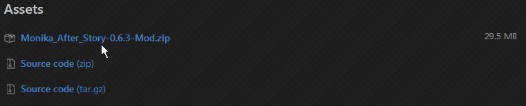

Once downloaded, **open it**. I recommend that you use **WinRAR** or **7-Zip**.

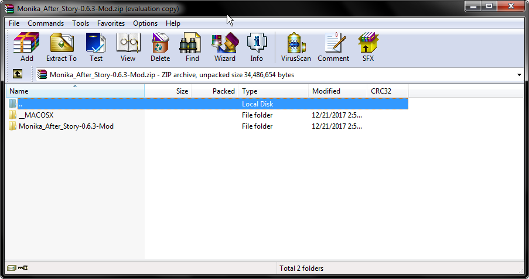

Now, double-click on** Monika_After_Story-0.6.3-Mod. **You should see a lot of files.
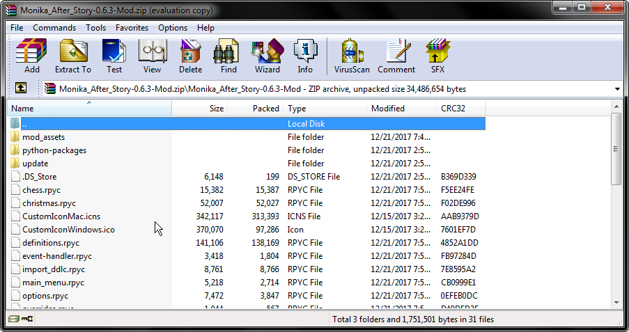
**DO NOT CLOSE THIS YET!**

Now, **find your installation** of DDLC. **If you are using Steam, **follow the instructions below. 

**If you are NOT using Steam, **find where you put your DDLC installation and scroll ahead.

Open **Steam** and click on **Library.**

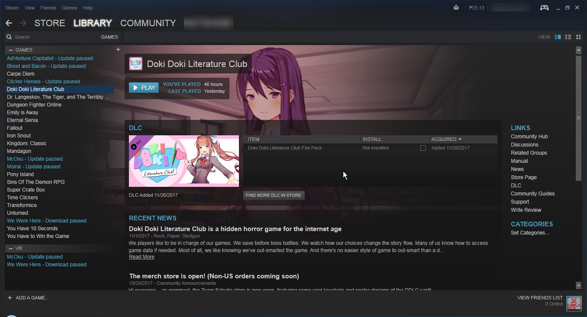

Right-click on **Doki Doki Literature Club **and click **Properties.**
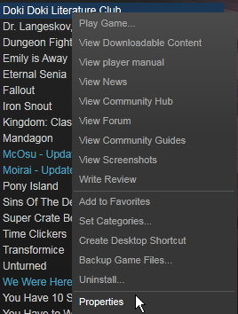

Now, click on **Local Files **at the top.

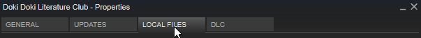

Then click on **Browse Local Files...**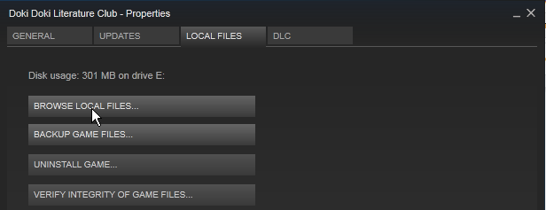

A window should **pop up.**

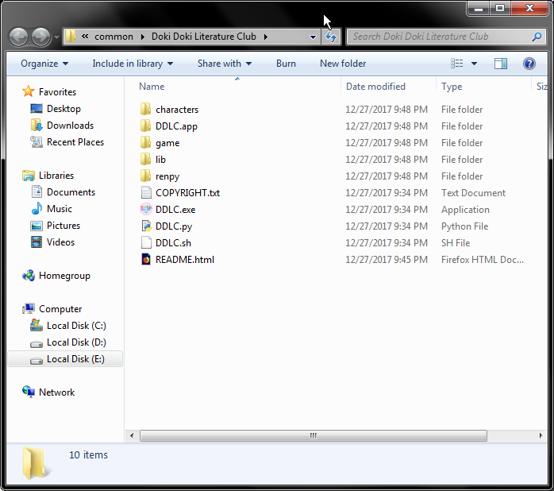

Now, **double-click **on the folder named **"game"**.

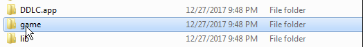

And you should be nearing the end. **Yay!**

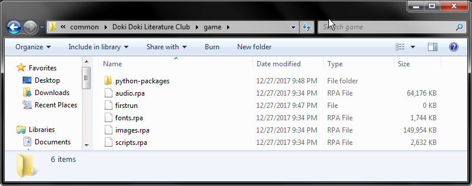

Now, **go back **to **WinRAR.**

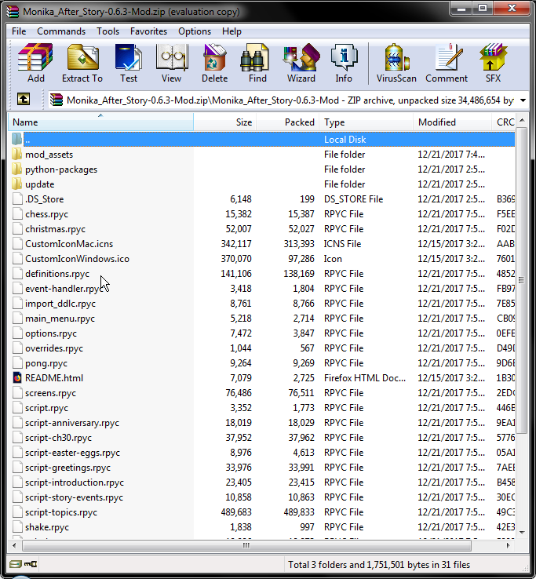

Select **all files **by pressing **Ctrl-A. **Then press **Ctrl-C **to copy.
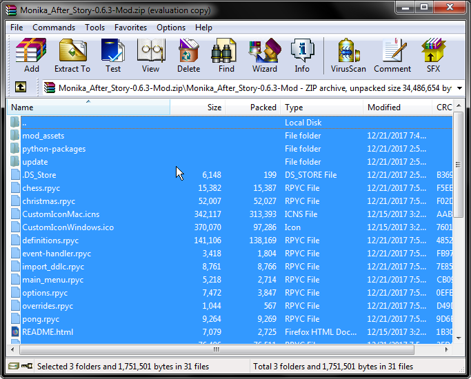

Now, **go back **to the other folder and press **Ctrl-V **to paste them. Or you can **drag and drop** it.

Basically, you’re doing this.
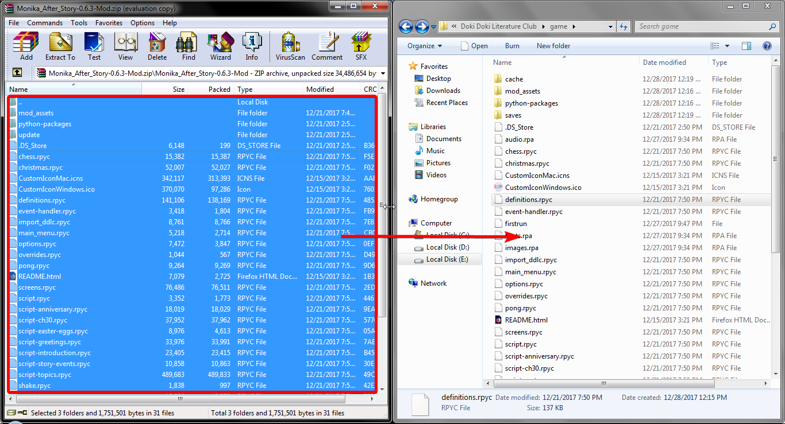

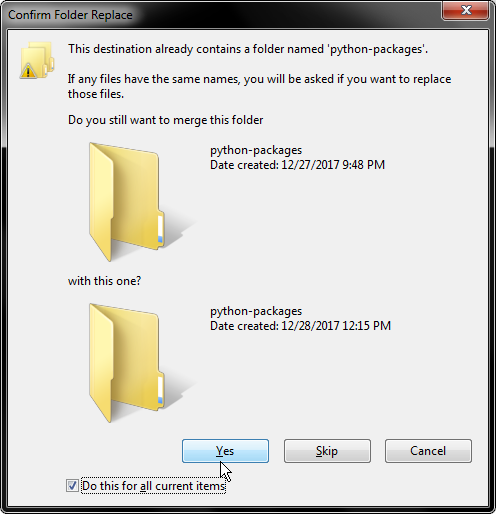

If Windows prompts you something, just click **"Yes".
**

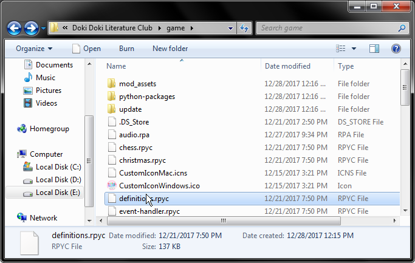

**And you’re good to go! Launch DDLC and everything should be different.**

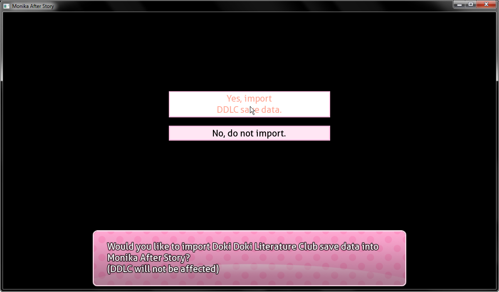

**Make sure to import DDLC save data so Monika knows you!**

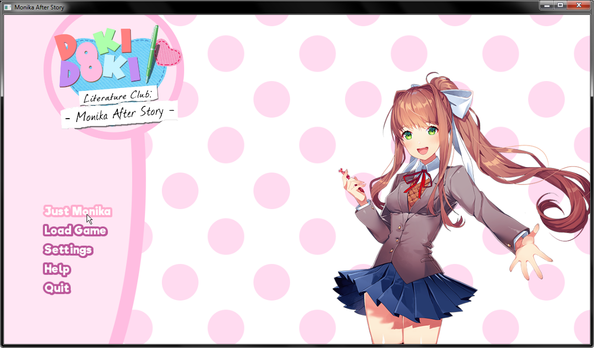

**Good job for following this guide! If you have any questions, hit me up on Facebook!**

Natsuki still best girl, though.

